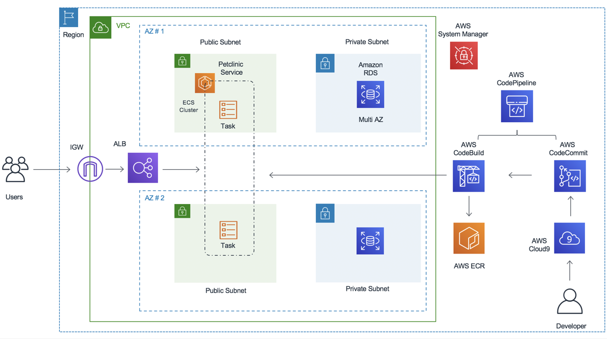

# Build and Deploy Spring Petclinic Application to Amazon ECS (Fargate) using Terraform and AWS CodePipeline


## Introduction

This repo is designed to get some hands-on experience using AWS CI/CD tools to build pipelines for ECS workloads. we will be using AWS services like AWS CodePipeline, AWS CodeCommit, AWS CodeBuild. 

## Background

The PetClinic sample application is designed using Spring application framework. It uses AWS RDS (MySQL) at the backend and use MAVEN to build the app and containerize using Docker.

## Architecture


## Prerequisites

Before you build the whole infrastructure, including your CI/CD pipeline, you will need to meet the following pre-requisites.

### AWS account

Ensure you have access to an AWS account, and a set of credentials with *Administrator* permissions. 


### Set up SSM parameter for DB passwd

```bash
aws ssm put-parameter --name /database/password  --value mysqlpassword --type SecureString
```

## Deploy petclinic application using the pipeline

You will now use git to push the petclinic application through the pipeline.


### Set up a local git repo for the petclinic application

Start by switching to the `petclinic` directory:

```bash
cd ../petclinic
```

Set up your git username and email address:

```bash
git config --global user.name "Your Name"
git config --global user.email you@example.com
```

Now ceate a local git repo for petclinic as follows:

```bash
git init
git add .
git commit -m "Baseline commit"
```

### Set up the remote CodeCommit repo

An AWS CodeCommit repo was built as part of the pipeline you created. You will now set this up as a remote repo for your local petclinic repo.

