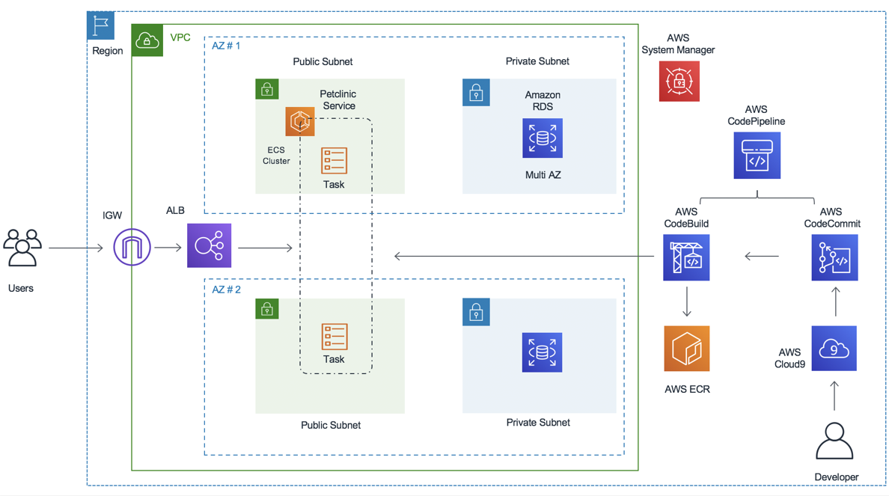

# Build and Deploy Spring Petclinic Application to Amazon ECS (Fargate) using Terraform and AWS CodePipeline


## Introduction

This repo is designed to get some hands-on experience using AWS CI/CD tools to build pipelines for ECS workloads. we will be using AWS services like AWS CodePipeline, AWS CodeCommit, AWS CodeBuild. 

## Background

The PetClinic sample application is designed using Spring application framework. It uses AWS RDS (MySQL) at the backend and use MAVEN to build the app and containerize using Docker.

## Architecture


## Prerequisites

Before you build the whole infrastructure, including your CI/CD pipeline, you will need to meet the following pre-requisites.

### AWS account

Ensure you have access to an AWS account, and a set of credentials with *Administrator* permissions. 

### Set up the remote CodeCommit repo

An AWS CodeCommit repo was built as part of the pipeline you created. You will now set this up as a remote repo for your local petclinic repo.

### Set up the Roles with necessary permision for Code Build and Code Pipeline

Code build Requires permision to ECR, Cloudwatch and S3
Codepipeline required permision to ECR, S3, Codecommit, Codestar, Cloudwatch

### Set up SSM parameter for DB passwd

```bash
aws ssm put-parameter --name /database/password  --value mysqlpassword --type SecureString
```
### Create RDS Mysql database 5.7 

## Deploy petclinic application using the pipeline

You will now use git to push the petclinic application through the pipeline.

```bash
cd ../petclinic
docker build -t petclinic .
docker run petclinic -p 8080:8080 -e 
```
